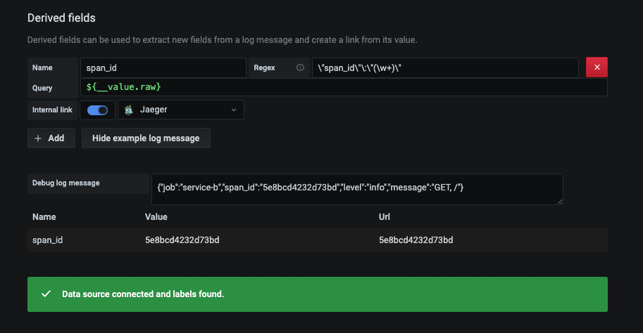
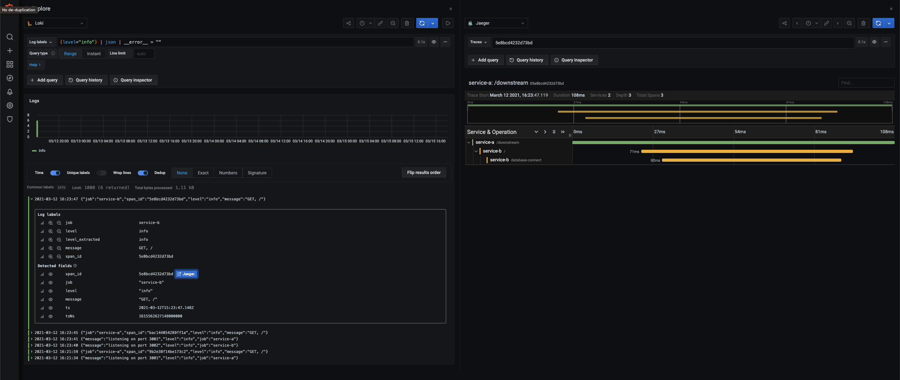

## Open Tracing Demo

An early repository to demonstrate how to use Open Tracing withing microservices + jaeger + loki + grafana to visualize and analyze traffic

## Getting started

To run this locally you will need `Docker` and `docker-compose` installed.

1. At the root level of the repository simply run `docker-compose up`, it will use the ports listed below so make sure they are not being used, once you want to stop this containers just use `Ctrl + C`

```
- 3100      -  Loki
- 3000      -  Grafana
- 27017     -  Mongo
- 5775/udp  -  jaeger
- 6831/udp  -  jaeger
- 6832/udp  -  jaeger
- 5778      -  jaeger
- 16686     -  jaeger
- 14268     -  jaeger
- 14250     -  jaeger
- 9411      -  jaeger
- 3001      -  Service A
- 3002      -  Service B
```

And the services it will start are (all as docker containers)

- Mongo database
- Jaeger all in one image
- Service A image
- Service B image

2. After all the containers are running, you will have the following endpoints endpoints available

```shell
## Service A

http://localhost:3001   # This endpoint will not call service B will only perform a simple database connection
http://localhost:3001/downstream # This endpoint will call service B, where Service B will perform a simple database connection

# Service B

http://localhost:3002/ # This endpoint will perform a simple database connection


# Grafana

http://localhost:3000


# Jaeger web UI

http://localhost:16686


```

### Manual steps

I'll automate this later

1. Go to http//:localhost:3000 and login with user: admin and password: admin
2. Go to configuration on the left bar and

- Add a Loki datasource, set the URL as http://loki:3100 leave everything else as is and click the button `Save & test`
- Add a Jaeger datasource, set the URL as http://jaeger:16686 leave everything else as is and click the button `Save & test`

3. Add a derived field by going to Datasources -> Select loki -> Scroll down to the Derived fields section and add the configuration for the following fields as shown in the image below

- Name: `span_id`
- Regex: `\"span_id\"\:\"(\w+)\"`
- Query: `${__value.raw}`
- Internal link enabled and select the jaeger connection



As you can see in the image you can use the following log sample to validate your regex

```
{"job": "service-b","span_id": "5e8bcd4232d73bd","level": "info","message": "GET, /"}
```

That's it you are ready to make calls on service A or service B through the browser or postman, you will be able to see very basic and simple tracing if you go in Grafana to the explore section on the left of the web ui, you can run queries as shown in the image below to filter logs, due to the derived fields configuration we defined Grafana will be able to identify the spanid and to link it with the jaeger trace



## TODO

- Change services to return and report errors randomly
- Automate grafana manual configuration steps
- Add built in container that will make requests to the endpoints

## Challenges that will come for us if we ever want to use a stack like this

- How do you rotate loki logs
- How do you run this in kubernetes?
- How do you work with retries
